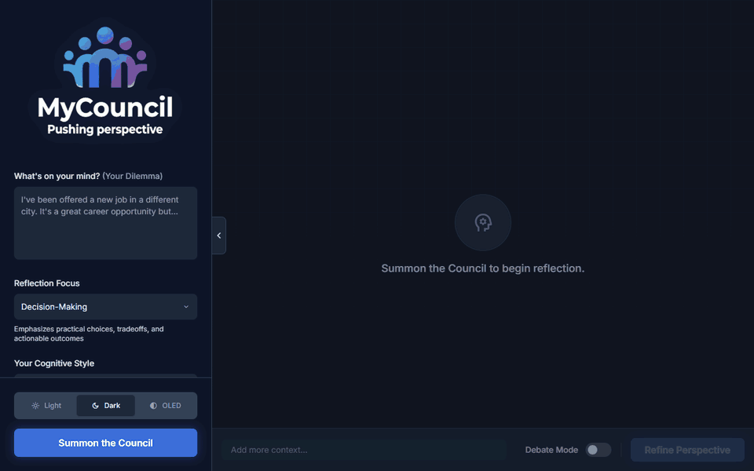

<p align="center">
    
</p>

# MyCouncil

**MyCouncil** is an interactive AI-powered reflection tool designed to help users navigate complex dilemmas. By "summoning a council" of diverse AI personas, users receive multi-faceted advice tailored to their situation and personality type.

<p align="center">
    
</p>

## 🌟 Key Capabilities

-   **Customizable Council Summoning**: Define your dilemma and assemble a council of 3-7 AI personas. Customize their "cognitive style" by selecting your MBTI type, or choose a balanced panel.
-   **Reflection Lenses**: Direct the council's analytical focus. Choose from **Decision-Making** (practical trade-offs), **Emotional Processing** (internal values), or **Creative Problem Solving** (novel approaches).
-   **Interactive Council Clash**: Watch counselors debate your dilemma in real-time. Identify "Tension Pairs" where perspectives conflict, and **inject your own thoughts** into the debate to see how they react and adjust their stances.
-   **1-on-1 Counselor Chat**: Go beyond the initial advice. Open a direct chat line with any counselor to ask follow-up questions or dig deeper into their specific perspective.
-   **Iterative Refinement**: As you reflect, new context often emerges. Add new details to your dilemma, and watch the council re-evaluate their positions and update their advice in real-time.
-   **Visual Insight Mapping**: Explore a dynamic 3D "Reflection Sphere" where counselors orbit your central dilemma. Visual tension lines highlight conflicting viewpoints, helping you understand the landscape of your decision.

## 🧠 Long-Term Memory & Retrieval (ML Work)

Counselors can recall what you said in earlier sessions. The interesting engineering is the retrieval pipeline and, more importantly, how it was evaluated. Code is in [`server/memory/`](server/memory) and the offline benchmark in [`bench/memory/`](bench/memory).

**Pipeline**: chunk past user turns → stage 1 candidate generation (dense embeddings with `bge-small-en-v1.5`, run locally via `@huggingface/transformers`; BM25 and RRF hybrid also implemented) → stage 2 selection (an LLM picks the best memories from the top 30 candidates, keeping the dense top 2 as a safety floor) → compact context block in the counselor prompt.

**Benchmark**: 48 synthetic multi-session scenarios and 240 probes (explicit, implicit, multi-turn, and *update* probes where a later fact supersedes an earlier one). Dev/test splits are separate; the selector design was frozen on dev before touching test. Metrics are recall@k, nDCG, MRR and "all required gold found". Everything is reproducible with `npm run bench:memory`, and result files are committed in [`bench/memory/results/`](bench/memory/results).

**Held-out test split (160 probes, k=5)**

| system | recall@5 | allGold@5 | nDCG@5 |
|---|---|---|---|
| recency baseline | 0.031 | 0.025 | 0.018 |
| dense (bge-small) | 0.713 | 0.669 | 0.603 |
| dense + MiniLM cross-encoder | 0.628 | 0.581 | 0.581 |
| dense + bge-reranker-base | 0.472 | 0.431 | 0.369 |
| **dense top-2 + LLM selector (shipped)** | **0.859** | **0.825** | 0.675 |

Findings worth knowing:
-   **Off-the-shelf cross-encoders hurt.** Both rerankers *lowered* recall versus plain dense retrieval, especially on implicit probes (probes with almost no word overlap with the answer), so they are off by default.
-   **The LLM selector helps most where it's hard.** On implicit probes it lifts recall@5 from 0.52 (dense) to ~0.80-0.86, because it can reason about relevance rather than match vocabulary.
-   **BM25 and hybrid didn't beat dense** on dev (recall@5 0.606 / 0.762 vs 0.775), so dense is the stage-1 default. BM25 is also weaker on implicit probes by construction.
-   **The candidate pool isn't the bottleneck** (pool recall@30 is 0.92-1.00 across slices on test), so gains come from ordering, not recall of stage 1.

**Known limitations (stated up front)**
-   The dataset is LLM-generated. A human review of a 20-probe sample found 6 defects (30%, 95% CI 14.5-51.9%); those and 19 superseded-gold references were fixed by hand, but the other ~220 probes were not individually reviewed and likely contain similar defects. Treat absolute numbers as indicative and relative comparisons as the signal.
-   Test set is 160 probes from 48 scenarios, so small gaps (a few points) are within noise. No confidence intervals on the system metrics yet.
-   The LLM selector adds a network call and its latency; see the latency tables in the result files. It is evaluated with one selector model (`amazon/nova-lite-v1`).
-   An LLM judge for dataset auditing exists but is not yet validated against human labels, so it gates nothing.

**In progress**: see open [GitHub issues](https://github.com/Khriis-K/MyCouncil/issues) for upcoming work (further retrieval ablations and benchmark hardening).

## 🛠️ Tech Stack

-   **Frontend**: [React 19](https://react.dev/)
-   **Backend**: Node.js, Express
-   **Build Tool**: [Vite](https://vitejs.dev/)
-   **Language**: [TypeScript](https://www.typescriptlang.org/)
-   **Retrieval / ML**: local `bge-small-en-v1.5` embeddings, BM25, RRF fusion, cross-encoder and LLM-based reranking, offline IR benchmark (recall@k, nDCG, MRR)
-   **Testing**: Vitest
-   **AI Integration**: [OpenRouter](https://openrouter.ai/) (OpenAI-compatible API; default model `amazon/nova-lite-v1`) with prompt engineering for natural, conversational dialogue and consistent pronoun usage.
-   **Styling**: Tailwind CSS & Custom CSS

## 🚀 Getting Started

Follow these instructions to get a copy of the project up and running on your local machine.

### Prerequisites

-   **Node.js**: Ensure you have Node.js installed (v18+ recommended).
-   **OpenRouter API Key**: Get one at [openrouter.ai](https://openrouter.ai/).

### Installation

1.  **Clone the repository** (if applicable) or navigate to the project directory.

2.  **Install dependencies**:
    ```bash
    npm install
    npm run models:download   # fetches the local embedding model
    ```

3.  **Environment Setup**:
    -   Create a file named `.env.local` in the root directory.
    -   Add your OpenRouter API key to the file:
        ```env
        OPENROUTER_API_KEY=your_actual_api_key_here
        ```
    > **Note**: The backend server uses this key to authenticate with OpenRouter.

4.  **Run the Application**:
    Start both the backend server and frontend client with a single command:

    ```bash
    npm start
    ```
    *   **Frontend**: http://localhost:3001 (Proxies API requests to backend)
    *   **Backend**: http://localhost:3000

    > **Note**: You can still run them individually using `npm run server` and `npm run dev` if preferred.

5.  **Open the App**:
    -   Visit http://localhost:3001 in your browser.

## 📖 Usage

1.  **Enter a Dilemma**: On the sidebar, type in the problem or decision you are facing.
2.  **Select MBTI (Optional)**: Click the MBTI icon to select your personality type for more tailored advice.
3.  **Summon the Council**: Click the "Summon Council" button.
4.  **Explore**:
    -   **Sphere View**: Interact with the visual representation of your council.
    -   **Counselors**: Click on a counselor's icon to read their specific advice.
    -   **Debates**: Toggle "Debate Mode" or click on the tension lines between counselors to see them discuss your dilemma.

## 🤝 Contributing

Contributions are welcome! Please feel free to submit a Pull Request.